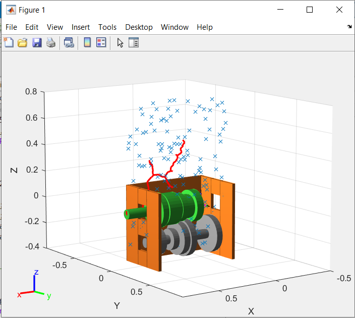
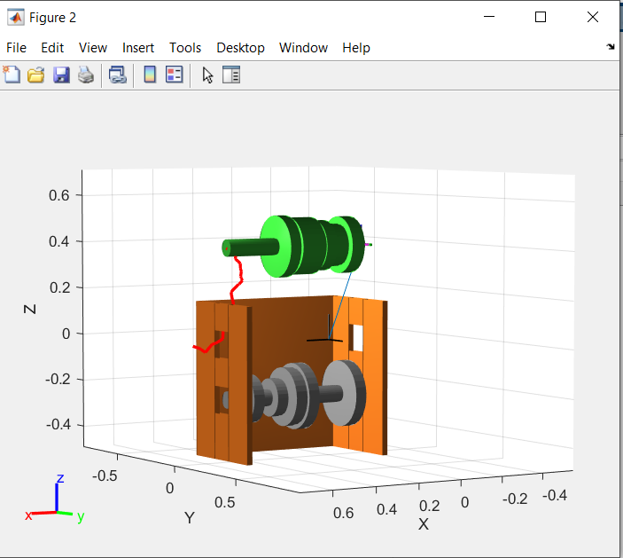
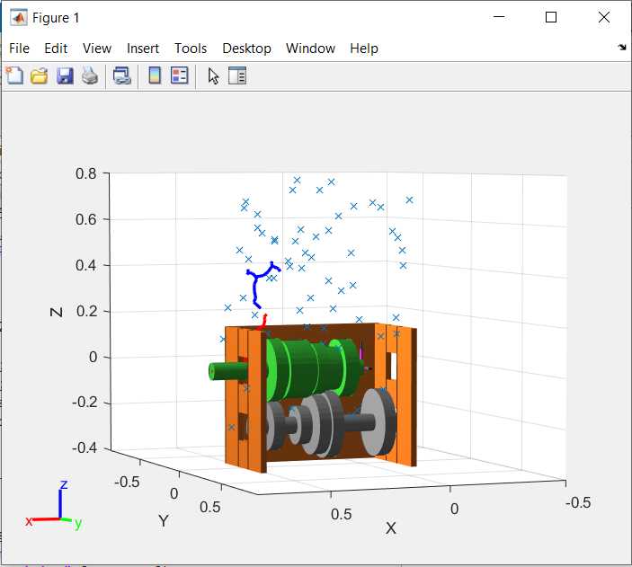
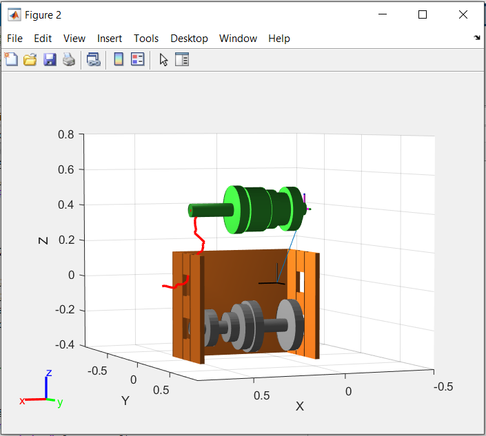

#  3D-RRT-Planner-for-Gear-shaft-removal
Create a RRT based motion planner to remove the mainshaft from the transmission case without any collisions to prevent damage. (Implemented as part of project for RBE550 - Motion Planning course)

## Steps to run the code
- Requires MATLAB Robotics toolbox to be added.
- There are two implementations of the algorithm:
	- Unidirectional RRT (starts at the start and searches a path to the goal) (set as default)
	- Bidirectional RRT (search is done both from start and goal node till a path is found) (to run this uncomment specified lines in `main.m`)
- To run the simulation run the `main.m` file in MATLAB.
- After the run a gif file of the path search is automatically saved in the code folder itself.

## Report
For detailed description of the implementation see the report [here](Report.pdf).

## Plots and Animations

### Unidirectional RRT
Paths explored by the planner and the final path found:

	
	

### Bidirectional RRT
Paths explored by the planner and the final path found:

Remaining plots are present in the report.

## References
1. Steven M. LaValle. Planning Algorithms. Cambridge University Press, May 2006. ISBN
9780521862059. URL http://lavalle.pl/planning/.

For GIF creation:

2. Greene, Chad A., et al. “The Climate Data Toolbox for MATLAB.” Geochemistry, Geophysics, Geosystems, vol. 20, no. 7, American Geophysical Union (AGU), July 2019, pp. 3774–81, doi:10.1029/2019gc008392.

